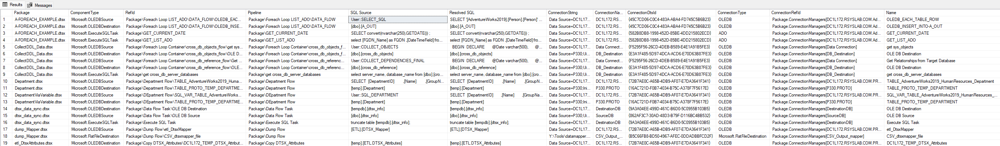

# DTSX DataReader
Intent is to extract key DTSX (SSIS) elements and attributes from source files and insert them into MSSQL tables for data mining, transparency, and compliance initiatives.
 
 **ATTENTION: ALPHA CODE NOT FOR PRODUCTION USAGE**

## Example DataMaper output
Simple example mapping packages, variables and SQL contained withing the SSIS package. TSQL to create view described in [SQL_Examples.md](SQL_Examples.md)

 

## Command Line Execution

### Example Execution 
```bash

.\DTSXDataLoader -p C:\\PATH\\DIRECTORY\\ -l -s -v -t

```

### Options
Not all options enabled.

```c-sharp
        [Option('v', "verbose", Required = false, HelpText = "Set output to verbose messages.")]
        public bool IsVerbose { get; set; } = false;

        [Option('p', "path", Required = false, HelpText = "Path to individual package or directory of packages")]
        public string? Path { get; set; }

        [Option('s', "sql", Required = false, HelpText = "SQL")]
        public bool IsSql { get; set; } = false;

        [Option('l', "lite", Required = false, HelpText = "Mapper and Variables Only")]
        public bool IsLite { get; set; } = false;

		[Option('t', "truncate", Required = false, HelpText = "Truncates all destination tables first")]
        public bool IsTruncate { get; set; } = false;

        [Option('x', "extension", Required = false, HelpText = "non-dtsx extension")]
        public string? Extension { get; set; } 

        [Option('o', "Output", Required = false, HelpText = "Output Directory")]
        public string? OutputDirectory { get; set; }
```
## Initial DB and App settings configuration

To change the default location of SSIS packages, Database Connection, and Dtsx tables, update the appsettings.json file.
### Appsettings.json

```json

{
  "Settings": {
    "DefaultPackageFile": "C:\\SSIS\\PACKAGE_DIR\\"
  },
  "ConnectionStrings": {
    "DefaultConnection": "Data Source=DBSERVER;Initial Catalog=DB;Trusted_Connection=True;Encrypt=False"
  },
  "ApplicationTables": {
    "DtsxAttributes": "ETL.DTSX_Attributes",
    "DtsxVariables": "ETL.DTSX_Variables",
    "DtsxElements": "ETL.DTSX_Elements",
    "DtsxMapper": "ETL.DTSX_Mapper"
  },
  "ScanElements": [
    "//*"
  ],

}


```

### SQL Table Dependencies

Changing Names and Scheme is allowed, however you will need to update the appsettings.json configuration file too.

```sql

CREATE TABLE [ETL].[DTSX_Attributes](
	[Id] [int] IDENTITY(1,1) NOT NULL PRIMARY KEY,
	[CreationName] [nvarchar](max) NULL,
	[Description] [nvarchar](max) NULL,
	[Filename] [nvarchar](max) NULL,
	[Package] [nvarchar](max) NULL,
	[ParentNodeDtsId] [nvarchar](max) NULL,
	[ParentNodeName] [nvarchar](max) NULL,
	[ParentNodeType] [nvarchar](max) NULL,
	[ParentUniqueId] [nvarchar](250) NULL,
	[UniqueId] [nvarchar](250) NULL,
	[ParentRefId] [nvarchar](max) NULL,
	[RefId] [nvarchar](max) NULL,
	[XPath] [nvarchar](max) NULL,
	[ElementXPath] [nvarchar](max) NULL,
	[AttributeName] [nvarchar](max) NULL,
	[AttributeType] [nvarchar](max) NULL,
	[AttributeValue] [nvarchar](max) NULL,
	[LoadDate] [datetime] NOT NULL DEFAULT CURRENT_TIMESTAMP,
);

 

CREATE TABLE [ETL].[DTSX_Elements](
	[Id] [int] IDENTITY(1,1) NOT NULL PRIMARY KEY,
	[CreationName] [nvarchar](max) NULL,
	[Description] [nvarchar](max) NULL,
	[Filename] [nvarchar](max) NULL,
	[Package] [nvarchar](max) NULL,
	[ParentNodeDtsId] [nvarchar](max) NULL,
	[ParentNodeName] [nvarchar](max) NULL,
	[ParentNodeType] [nvarchar](max) NULL,
	[ParentUniqueId] [nvarchar](250) NULL,
	[UniqueId] [nvarchar](250) NULL,
	[ParentRefId] [nvarchar](max) NULL,
	[RefId] [nvarchar](max) NULL,
	[XPath] [nvarchar](max) NULL,
	[DtsId] [nvarchar](max) NULL,
	[Name] [nvarchar](max) NULL,
	[NodeType] [nvarchar](max) NULL,
	[Value] [nvarchar](max) NULL,
	[XmlType] [nvarchar](max) NULL,
	[LoadDate] [datetime] NOT NULL DEFAULT CURRENT_TIMESTAMP,
);

 

CREATE TABLE [ETL].[DTSX_Mapper](
	[Id] [int] IDENTITY(1,1) NOT NULL PRIMARY KEY,
	[Description] [nvarchar](max) NULL,
	[Package] [nvarchar](max) NULL,
	[RefId] [nvarchar](max) NULL,
	[SqlStatement] [nvarchar](max) NULL,
	[ConnectionString] [nvarchar](max) NULL,
	[ConnectionName] [nvarchar](max) NULL,
	[ConnectionDtsId] [nvarchar](max) NULL,
	[ConnectionType] [nvarchar](max) NULL,
	[ConnectionRefId] [nvarchar](max) NULL,
	[Name] [nvarchar](max) NULL,
	[ComponentType] [nvarchar](max) NULL,
	[LoadDate] [datetime] NOT NULL DEFAULT CURRENT_TIMESTAMP,
);
 

CREATE TABLE [ETL].[DTSX_Variables](
	[Id] [int] IDENTITY(1,1) NOT NULL PRIMARY KEY,
	[CreationName] [nvarchar](max) NULL,
	[Description] [nvarchar](max) NULL,
	[Filename] [nvarchar](max) NULL,
	[Package] [nvarchar](max) NULL,
	[ParentNodeDtsId] [nvarchar](max) NULL,
	[ParentNodeName] [nvarchar](max) NULL,
	[ParentNodeType] [nvarchar](max) NULL,
	[ParentUniqueId] [nvarchar](250) NULL,
	[UniqueId] [nvarchar](250) NULL,
	[ParentRefId] [nvarchar](max) NULL,
	[RefId] [nvarchar](max) NULL,
	[XPath] [nvarchar](max) NULL,
	[EvaluateAsExpression] [nvarchar](max) NULL,
	[IncludeInDebugDump] [nvarchar](max) NULL,
	[VariableDataType] [nvarchar](max) NULL,
	[VariableDtsxId] [nvarchar](max) NULL,
	[VariableExpression] [nvarchar](max) NULL,
	[VariableName] [nvarchar](max) NULL,
	[VariableNameSpace] [nvarchar](max) NULL,
	[VariableValue] [nvarchar](max) NULL,
	[LoadDate] [datetime] NOT NULL DEFAULT CURRENT_TIMESTAMP,
);

```